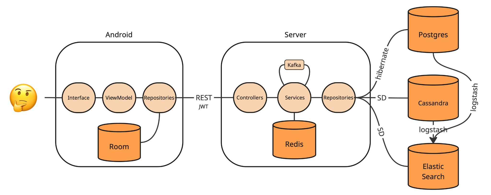

    <h1>Pensieve</h1>
    
- the application where you can share moments.

    <a href="#about-project">About</a> •
    <a href="#pensieve-features">Features</a> •
    <a href="#application-architecture">Architecture</a> •
    <a href="#components-of-the-application">Components</a> •
    <a href="#look-at-the-preview">Preview</a> •
    <a href="#about-authors">Authors</a>
    <h2></h2>

## About project:

**Pensieve** (this is the name of the stone bowl for viewing memories from Harry Potter) is an application where people create themes and post to them.

By linking a post to a specific topic, life moments take on a particular emotional tone, and the posts gain greater significance for the user. Each post includes a photo, a text description, and geolocation data, and they can be viewed in the user's profile either as a grid or on a map. Additionally, our app allows users to search by free-form themes and post descriptions, as well as browse feeds of popular posts and trending themes. Users can also search for and follow other users. Another key feature is the ability to create collaborative posts, which appear in the user's profile under the 'Albums' section.

Pensieve is a place where you can discover something new about another person!

  

## Features:
- **Profiles:** username, description, photo.
- **Themes:** creation, posting to them and saving.
- **Posts:** in the form of a grid and a map.
- **Albums:** storage for posts shared with friends.
- **Feed:** popular posts, themes and posts from subscriptions.
- **Interaction between users:** subscription and search.
- **Smart search:** search for posts and themes by free description.

## Application architecture:

    

## Components of the application: 
Pensieve consist of [Server](https://github.com/pensieve-project/pensieve-server) and [Android](https://github.com/pensieve-project/pensieve-android) parts. To run the application you should download both parts.

You can see the installation instructions in [README for Server](https://github.com/pensieve-project/pensieve-server/blob/main/README.md) and [README for Android](https://github.com/pensieve-project/pensieve-android/blob/main/README.md).

## Look at the preview:
**<a href="https://drive.google.com/file/d/1ndsAAH6xQLmk8bwD8MyqdlA7rLyBCMBG/view?resourcekey">Here</a> you can watch the demo video.**

     
    
    

## About authors:
 <b>Developers:</b>
 - [Golovachev Sergey](https://github.com/GolovachevS)
 - [Kolesova Sonya](https://github.com/kolesovasonya)
 - [Chernokulskaya Alina](https://github.com/chernaaaa)
 
 <b>Mentor:</b>
 - [Matskevich Valery](https://github.com/blonded04)</a> 

 National Research University Higher School of Economics, St. Petersburg, Spring 2025
